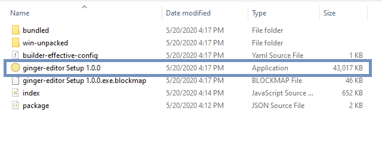
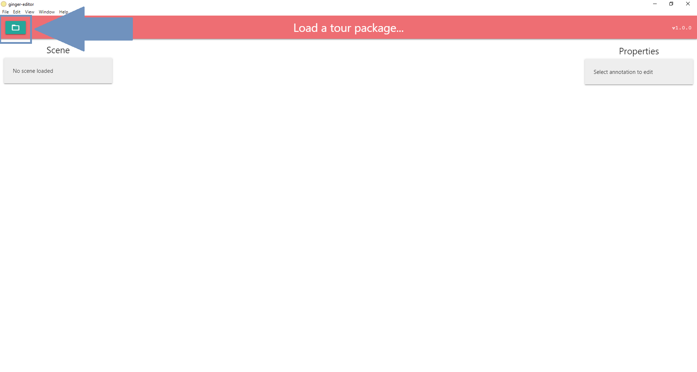
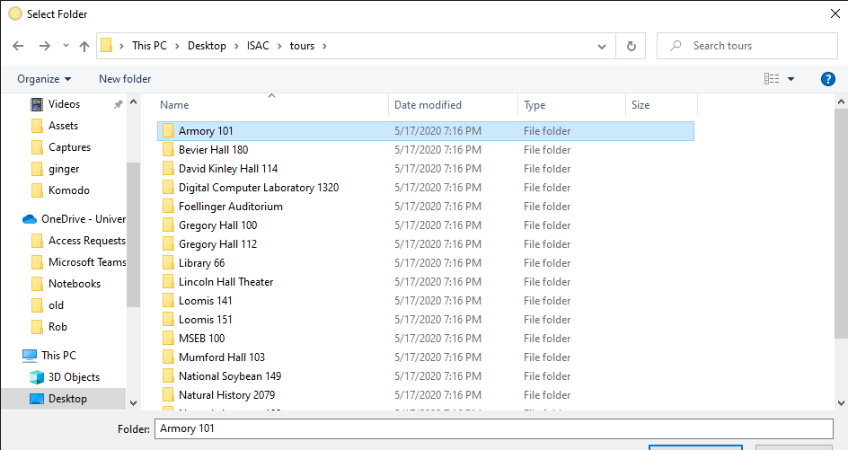
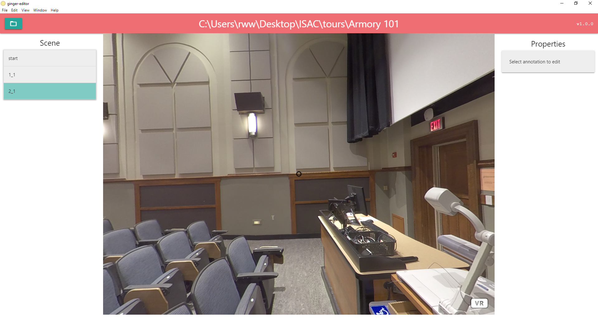
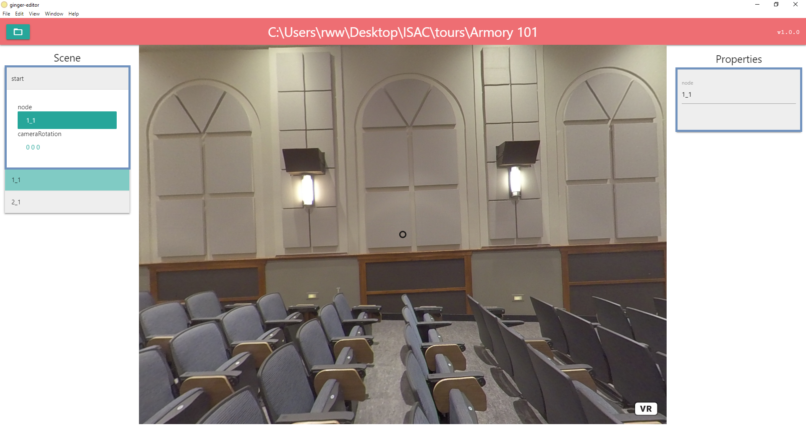
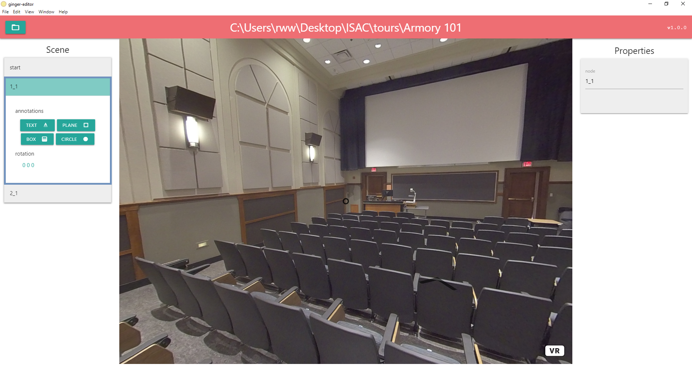
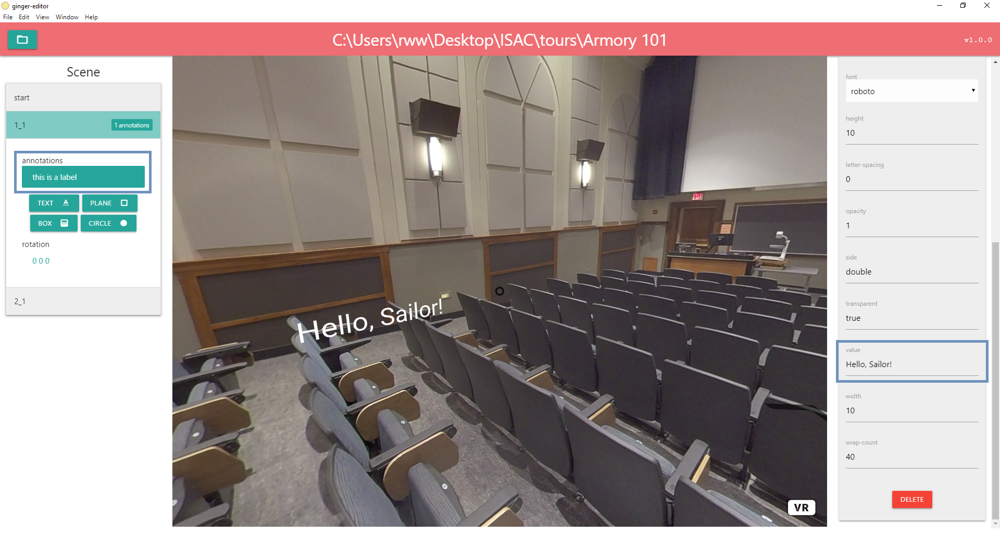
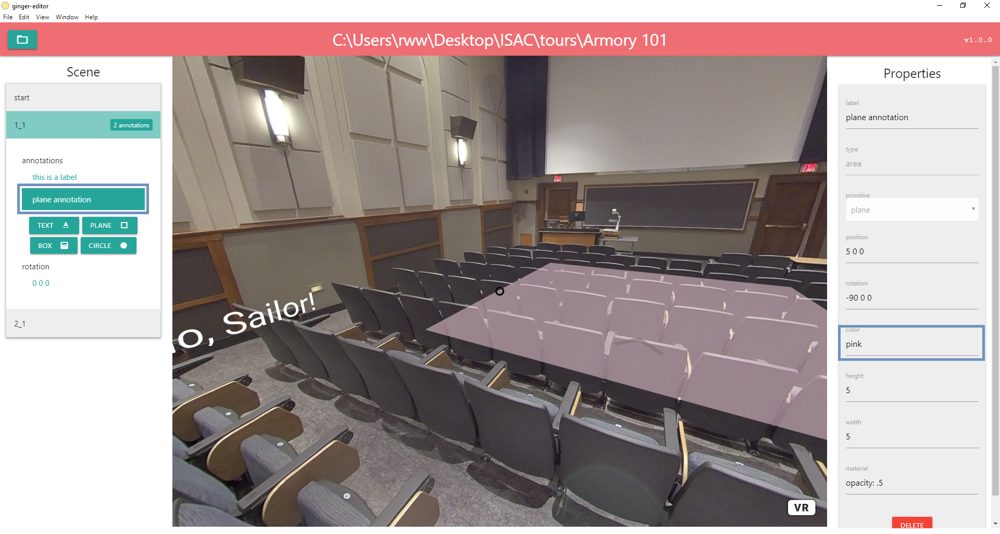

## Ginger Editor
A desktop application built with Vue.js and Electron

#### Project setup
```
npm install
```

#### Compile and hot-reload for development
```
npm run electron:serve
```

#### Compile and build for distribution
```
npm run electron:build
```
see https://www.electron.build/configuration/configuration for build options. 
_____

#### Usage

##### Installation
###### Windows
Builds for Windows will include a `ginger-editor Setup vX.X.X` installer at top level of the distribution. Simply run this application to install Ginger Editor and its dependencies to the appropriate location. Alternatively, you may skip this step and run `ginger-editor.exe` directly from the `win-unpacked` directory.



###### Mac OSX
Coming soon...

##### Open a tour package
To load a generated `ginger` tour package into the editor, using the open button at the top left of the editor window. Select the directory containing the generated `index.html` and static assets. 



Select the folder which contains the tour package files. 



This will load the tour package and start the tour on the node indicated in the configuration file. By default this will be node `1_1`. In the example below, the tour is configured to start on node `2_1`, so this is the node that is highlighted in the `Scene`. Nothing will be selected when the tour is first loaded. 



##### Change the starting node for the tour
To change node on which the tour starts, select the `start` section from the `Scene` panel on the left. Click on the `node` property. This will open the start node property in the `Properties` on the right. Change the starting node (in this case, from `2_1` to `1_1`). Hit Enter, or deselect the tab to save your changes. Now when the tour loads it will start on node `1_1` (This is the default behavior). 



##### Add a text annotation
To add a text annotation to a node, click on the node you want to edit in the `Scene` panel. You will see the option to add four kinds of annotations:
* Text
* Plane
* Box (or cube)
* Circle



Click on the `Text` option. This will load a default text annotation into the `Properties` panel. Give it a label, to make finding annotations easier in the `Scene` panel. Add a value, and hit Enter, or deselect the field. The annotation will appear at the default location in the node. There are various properties you can change, such as the size and font of the text. 



##### Add a geometric annotation
There are three supported geometric annotation types at this time. Select `Plane` to add a planar shape to the scene. Change the height, width, color, and opacity of the plane. 



##### Remove annotations
To remove an annotation, use the `Delete` button at the bottom of the annotation `Properties`. Warning, this cannot be undone!

